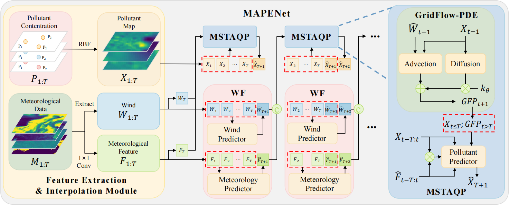

# Fine-Grained Spatiotemporal Air Quality Forecasting Guided by Chemical Transport Modeling

<p align="center">
  
</p>

This porject contains the implementation of MAPENet in PyTorch.

## Directory Structure
```text
MAPENet/       
├── data                    # Original data
├── dataset
├── logs
├── weights 
├── model                   # Main structure of MAPENet
├── cfg.py                 
├── flow.py                 # Train / validation / test flow logic
├── pipeline.py             # Main script
├── utils.py                
└── README.md       
```
## Requirements

- `torch`
- `numpy`
- `pandas`
- `tqdm`
- `matplotlib`

To install the main requirements:

```bash
pip install -r requirements.txt
```
## Dataset
- China: The original air quality data is accessible at [this link](https://ojs.aaai.org/index.php/AAAI/article/view/26676)
  
- USA: The air quality dataset can be downloaded at [EPA](https://aqs.epa.gov/aqsweb/airdata/download_files.html)

- Global Meteorological Data: 
  You can obtain regional meteorological inputs by cropping the data from this [global dataset](https://www.ncei.noaa.gov/products/weather-climate-models/global-forecast).
  Only **the observational components** are used in this work; forecast values provided in the dataset are ignored.

- Samples with missing or invalid data are filtered using the precomputed index file:  
  `data/dataset/saved/available_1_indices_.pt`.

## Prepare data
Use the script below to preprocess pollutant `.csv` files into model-ready tensors including GT pollutant tensor `P` and RBF-interpolated pollutant input `X`:

```bash
python data/air_quality/prepare_data.py
```
Precomputed channel-wise normalization parameters are stored in  
  `data/dataset/saved/normalization_params_.pt`.

## How to Run the Code
Run the code below to train and evaluate

```bash
python pipeline.py ODETAU cuda:0 --il 12 --ol 4
```

